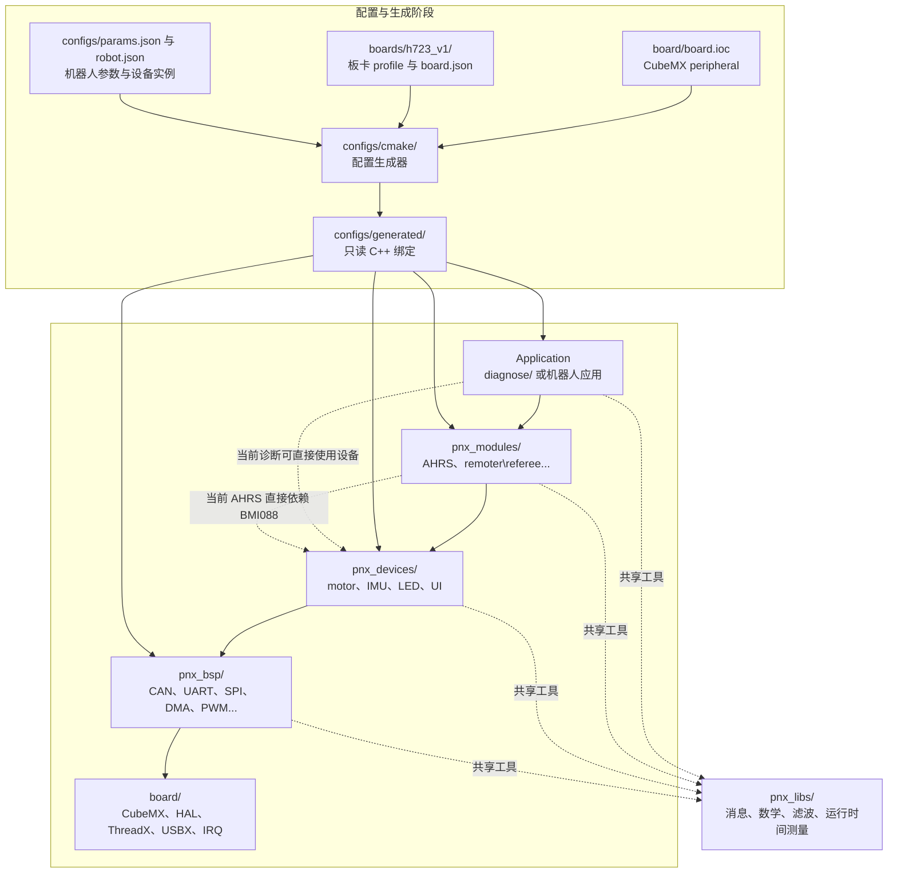

# 项目结构

| 目录 | 职责 |
| --- | --- | 
| `board/` | STM32CubeMX/HAL/ThreadX/USBX 生成工程、启动文件、链接脚本和工具链文件。 |
| `boards/h723_v1/` | 硬件板子的.json文件，用于绑定开发板引脚与内存等，一般在上层开发中不需要改动(TODO:stm32f4待补充) |
| `configs/` | JSON 和 CMake 生成器，用于进行机器人的必要配置，详见[配置](configuration.md)。 |
| `pnx_bsp/` | (Submodule) 对 HAL 外设的小型封装 |
| `pnx_devices/` | (Submodule) 电机、IMU、LED、UI 等基于 BSP 的具体设备与接口 | 
| `pnx_modules/` | 	(Submodule) AHRS、遥控器、裁判系统等服务线程 |
| `pnx_libs/` |(Submodule) msg、CRC、控制、滤波等通用库 | 
| `diagnose/` | 用于测试的单元 | 

四个 submodule 都由顶层 CMake 直接编译。

## 分层关系

